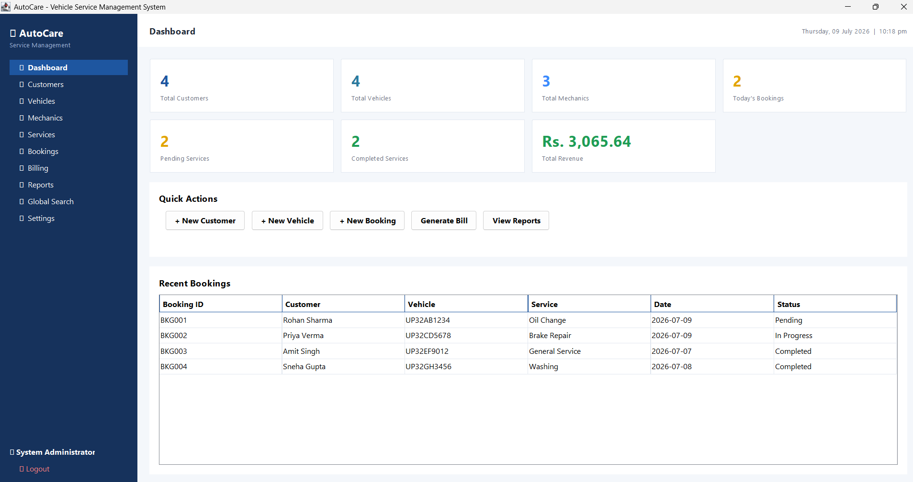
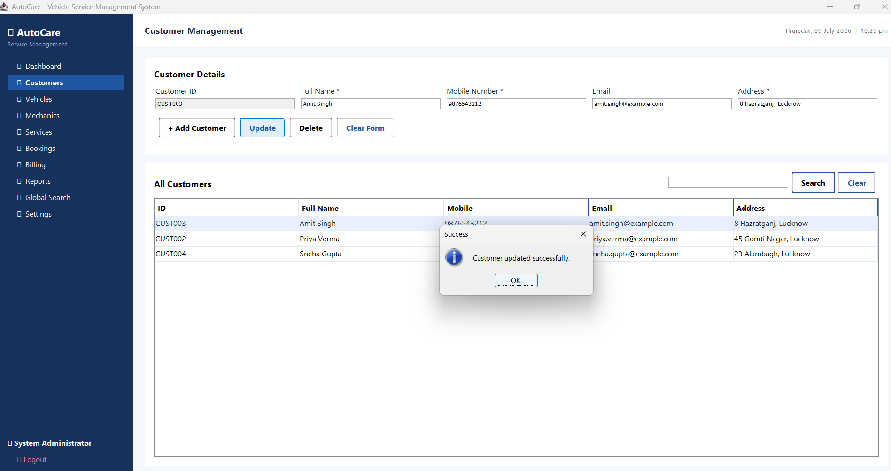
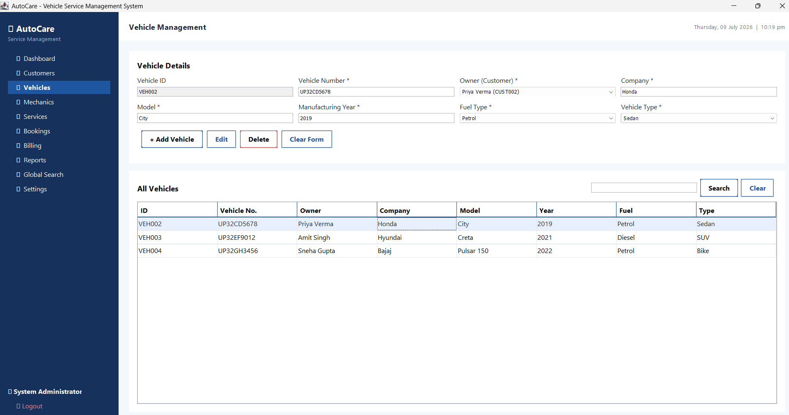
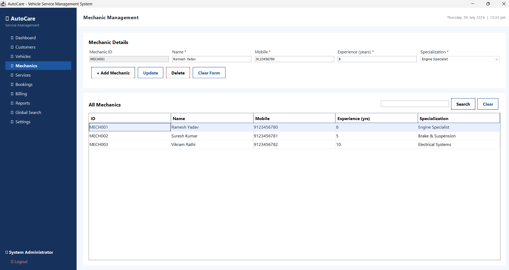
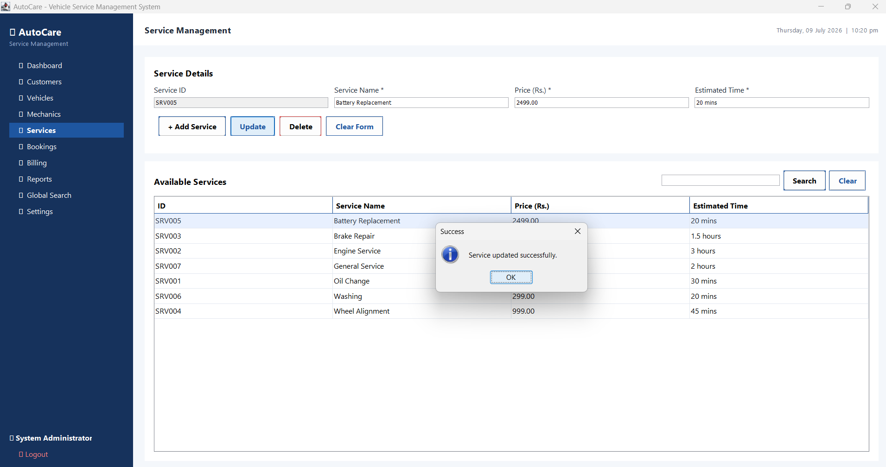
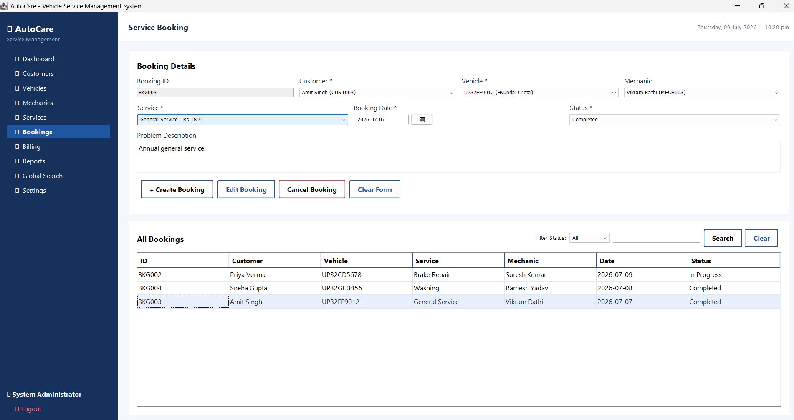
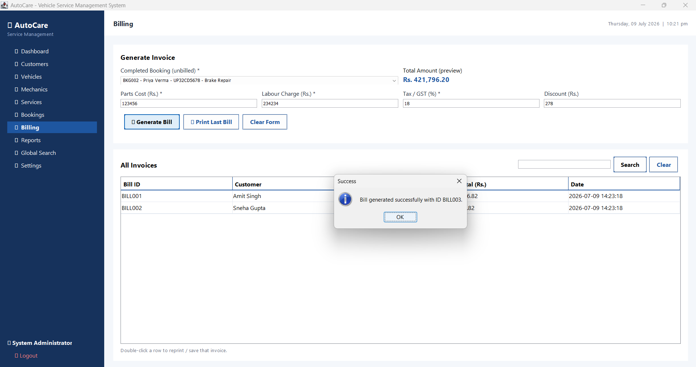
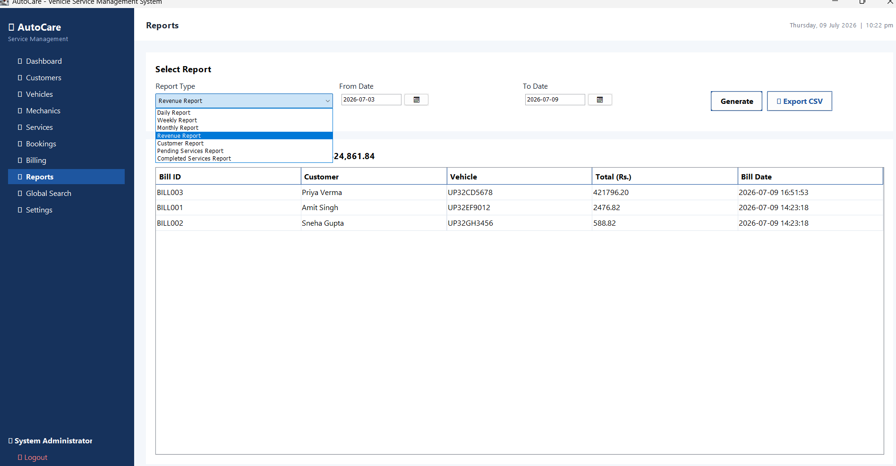
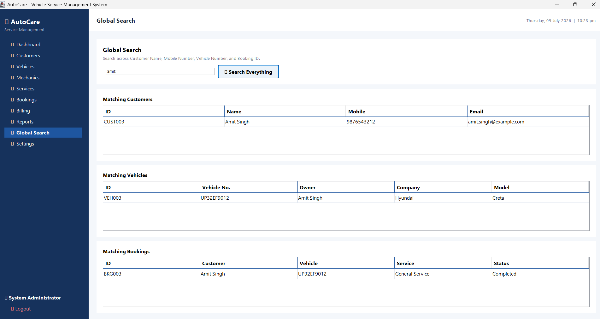
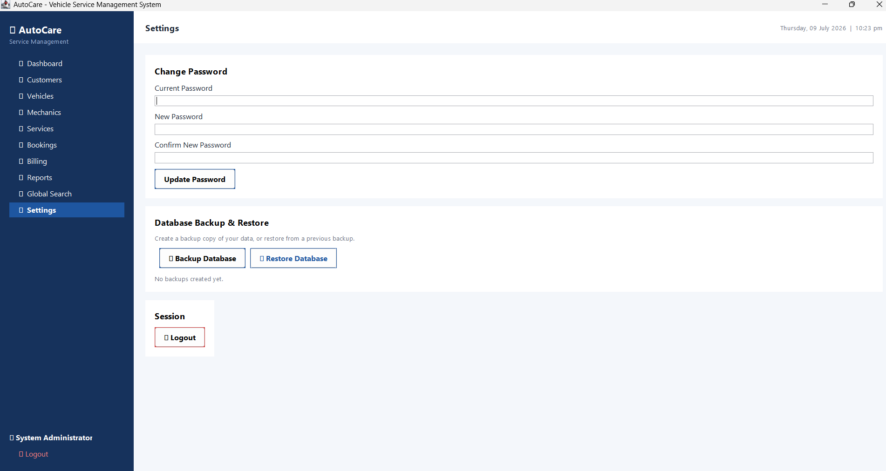

# 🚗 AutoCare — Vehicle Service Management System (Java Edition)

The same Vehicle Service Management System, rebuilt in **Java** (Swing +
SQLite via JDBC), packaged as a Maven project so it builds into a single
runnable `.jar` file — a proper installable **desktop app**.

---

## 🗂 Project Structure

```
vsms-java/
├── pom.xml                     # Maven build file (fetches the SQLite JDBC driver)
├── data/                       # Auto-created: vsms.db, backups/, invoices/
└── src/main/java/com/autocare/vsms/
    ├── Main.java                 # Application entry point
    ├── database/
    │   └── DatabaseManager.java  # SQLite schema, seeding, connection singleton
    ├── models/                   # Plain Java objects (Customer, Vehicle, ...)
    ├── controllers/              # Business logic + validation + SQL queries
    │   ├── AuthController.java
    │   ├── CustomerController.java
    │   ├── VehicleController.java
    │   ├── MechanicController.java
    │   ├── ServiceController.java
    │   ├── BookingController.java
    │   ├── BillController.java
    │   ├── DashboardController.java
    │   └── ReportController.java
    ├── ui/                        # Swing views (one class per module)
    │   ├── Theme.java               # Colors & fonts
    │   ├── Widgets.java              # Reusable components (cards, tables, buttons...)
    │   ├── DatePickerField.java      # Built-in date picker
    │   ├── LoginFrame.java
    │   ├── ForgotPasswordDialog.java
    │   ├── MainFrame.java            # Sidebar + top bar + view switcher
    │   ├── DashboardPanel.java
    │   ├── CustomerPanel.java
    │   ├── VehiclePanel.java
    │   ├── MechanicPanel.java
    │   ├── ServicePanel.java
    │   ├── BookingPanel.java
    │   ├── BillingPanel.java
    │   ├── ReportsPanel.java
    │   ├── SearchPanel.java
    │   └── SettingsPanel.java
    └── utils/                     # Validators, ID generator, invoice/CSV export, backup
```

This mirrors the same clean separation (UI / Controllers / Models / Database
/ Utils) that's easy to explain in a project viva.

---

## ⚙️ Requirements

- **Java 17 or later (JDK, not just JRE)** — needed to *build* the project.
  Check with:
  ```
  java -version
  javac -version
  ```
  If `javac` is missing, install a JDK:
  - Windows/macOS: download from [Adoptium](https://adoptium.net/) (Temurin 17 or 21)
  - Ubuntu/Debian: `sudo apt-get install openjdk-21-jdk`
- **Maven** (to build). Check with:
  ```
  mvn -version
  ```
  If missing:
  - Windows/macOS: download from [maven.apache.org](https://maven.apache.org/download.cgi)
  - Ubuntu/Debian: `sudo apt-get install maven`
  - **VS Code users:** install the "Extension Pack for Java" from the
    Extensions marketplace — it bundles Maven support and gives you a Run
    button directly on `Main.java`.

The **first build needs an internet connection once**, so Maven can
download the `sqlite-jdbc` driver (pure Java, no native installs needed)
and the build plugins. After that, it works offline.

---

## ▶️ How to Run

### Option A — VS Code (recommended, easiest)

1. Open the `vsms-java` folder in VS Code.
2. Install the **"Extension Pack for Java"** if prompted (or via Extensions
   sidebar) — VS Code will detect the Maven project automatically.
3. Open `src/main/java/com/autocare/vsms/Main.java`.
4. Click the **▶ Run** button that appears above the `main` method
   (or right-click the file → **Run Java**).
5. The Login window should appear in a few seconds.

### Option B — Terminal / Command line

From inside the `vsms-java` folder:

```bash
# Build a runnable jar (downloads dependencies on first run)
mvn clean package

# Run it
java -jar target/vsms.jar
```

### Default login

```
Username: admin
Password: admin123
```

On first run the app automatically creates `data/vsms.db`, creates all
tables, and seeds it with sample customers, vehicles, mechanics, services,
and bookings.

---

## 🖨 Turning it into a native installer (.exe / .app / .deb) — optional

Once you have a working jar, Java's built-in `jpackage` tool (bundled with
JDK 17+) can wrap it into a native installer so it can be shared and
double-clicked like any other desktop app, with no separate Java install
required on the target machine:

```bash
jpackage --input target/ --name AutoCare --main-jar vsms.jar ^
  --main-class com.autocare.vsms.Main --type exe
```
(use `--type dmg` on macOS, `--type deb` or `--type rpm` on Linux; drop the
`^` line-continuation and use `\` on macOS/Linux instead).

---

## 🗃 Database Design

Same SQLite schema as the original design, with proper primary/foreign
keys and cascading deletes:

| Table    | Primary Key   | Foreign Keys |
|----------|---------------|--------------|
| Admin    | admin_id      | — |
| Customer | customer_id   | — |
| Vehicle  | vehicle_id    | owner_id → Customer |
| Mechanic | mechanic_id   | — |
| Service  | service_id    | — |
| Booking  | booking_id    | customer_id → Customer, vehicle_id → Vehicle, mechanic_id → Mechanic, service_id → Service |
| Bill     | bill_id       | booking_id → Booking |

---

## 🖨 Printing Invoices

Invoices are generated as clean, styled **HTML files** saved under
`data/invoices/` and opened automatically in your default web browser,
which triggers the print dialog. From there you can print directly or
choose **"Save as PDF"**.

---

## 🔒 Notes on Security

Passwords are hashed with SHA-256 before being stored — plaintext
passwords are never saved to the database.

---

## ⚠️ A note on this build

This code was written and syntax/structure-verified carefully (package
declarations, imports, brace/paren balance, and text-block pairing were all
checked programmatically), but it was **not compiled or run in a live JVM**
before delivery, since no JDK compiler or internet access was available in
the authoring environment. If you hit a build error when you first run
`mvn clean package`, copy the error message back and it can be fixed
quickly — Maven's error output points directly to the file and line.

## 📸 Screenshots

## 📸 Screenshots

### Dashboard


### Customer Management


### Vehicle Management


### Mechanic Management


### Services


### Booking Management


### Billing


### Reports


### Global Search


### Settings

